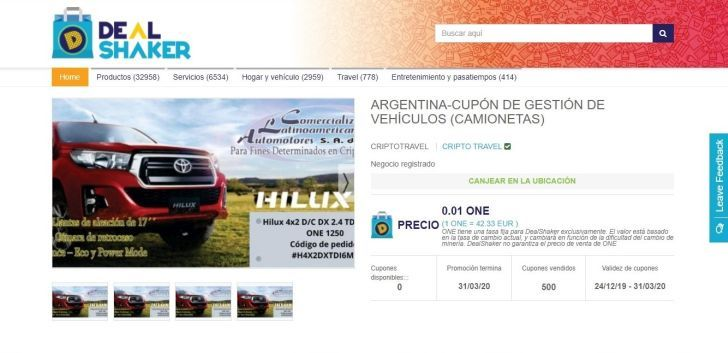
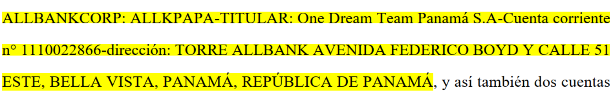
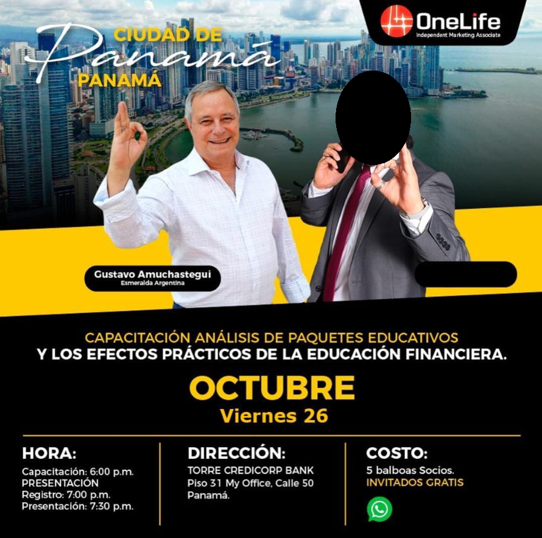
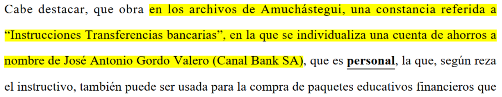
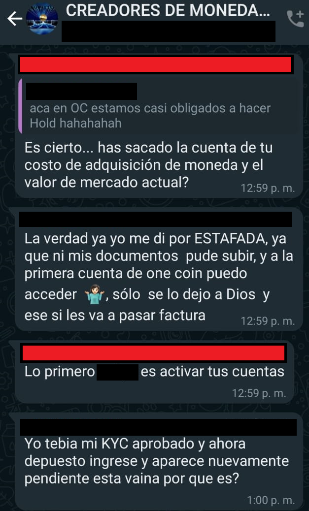
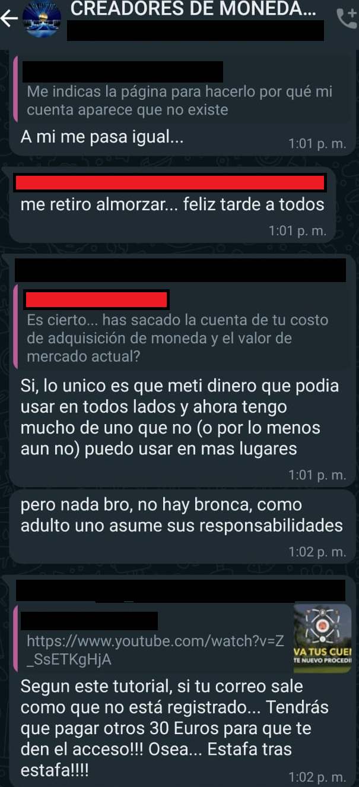
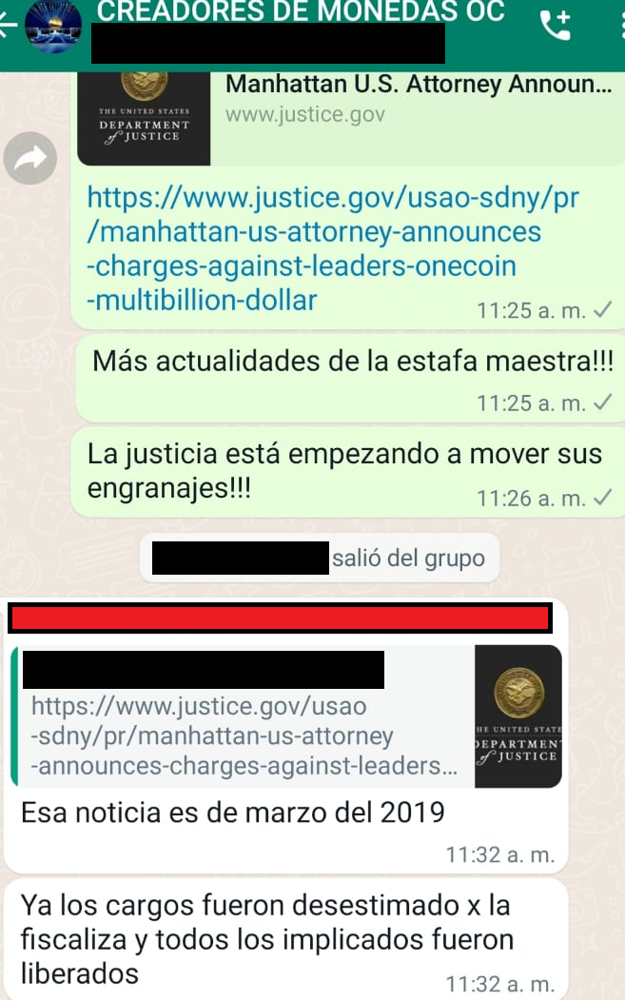
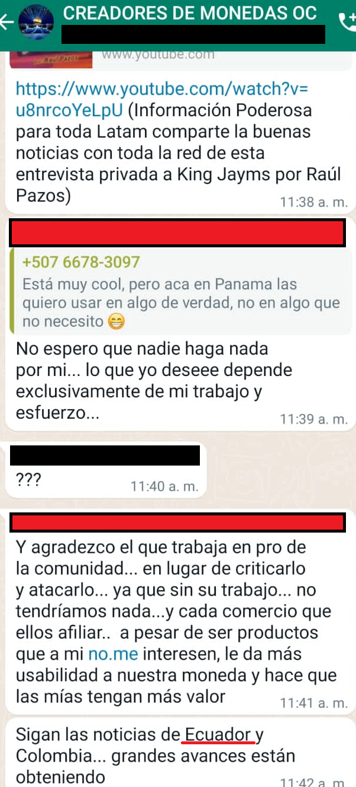
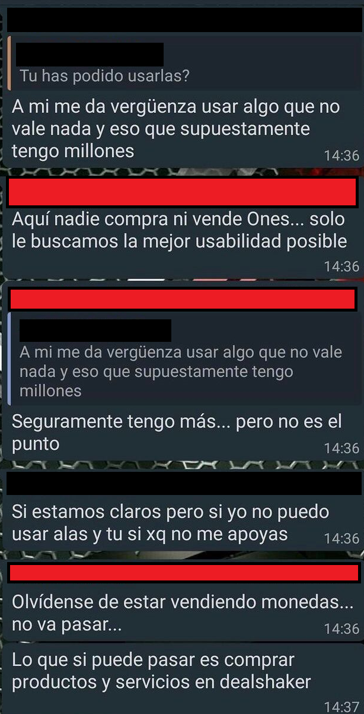
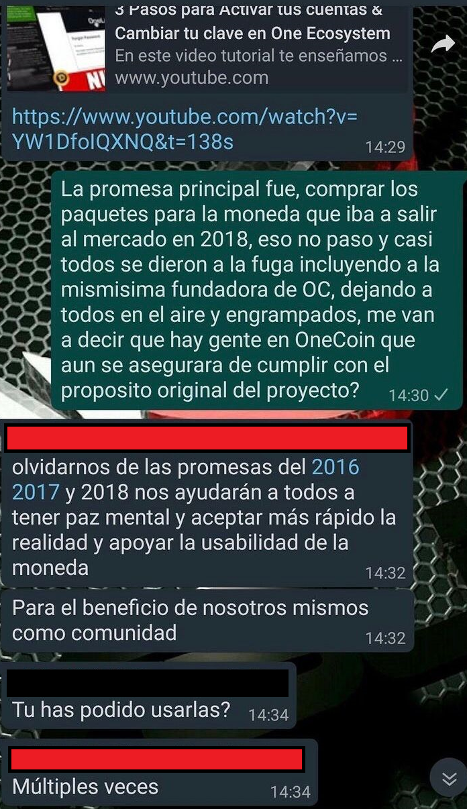

Las criptomonedas son sin duda una tecnología fascinante, con un gran potencial para transformar la manera que realizamos transacciones. Los posibles grandes retornos que acompañan a este mercado lucrativo, pero de alto riesgo ha sido utilizado para ejecutar grandes fraudes, que a menudo dejan a sus victimas con perdidas devastadoras.Uno de estos ejemplos es OneCoin, una estafa global que alcanzo los $4 mil millones de dólares. Pero, que ofrecían que tenia tanto poder de persuasión y como lograron expandir esta estafa alrededor del mundo? 

> "Lo que nos hace diferentes a Bitcoin, y a todas las [cripto]monedas de Mickey Mouse que copian nuestro concepto, es nuestra visión... quienes visiten nuestro nuevo sitio onecoin[.]eu podrán ver mucha información sobre One Coin y nuestra visión." 
Estas son las palabras de la Dr. Ruja Ignatova, en el [evento Coin Rush Global del 11 de Junio de 2016](https://youtu.be/638_Jpp2Rq8?t=428), luego de ser introducida con gran ímpetu y pasión por Karl Sebastian Greenwood, quien la describió como: "la creadora, la mente maestra y fundadora de las criptomonedas, de [OneCoin](https://www.investopedia.com/terms/o/onecoin.asp)."

La infame "Criptoreina" desapareció en el 2017, tomo un avión de Bulgaria a Grecia y no se supo más de ella. Recientemente el [FBI publico una advertencia de los 10 más buscados](https://www.fbi.gov/wanted/topten/ruja-ignatova/), en donde indican que puede tener escoltas armados, y que su apariencia a podido cambiar con cirugía plástica.

Ofrecen una recompensa de $100,000 dólares, y también mantiene [advertencias de búsqueda con la Interpol](https://www.interpol.int/How-we-work/Notices/View-Red-Notices#2020-9611), y con la [Europol](https://eumostwanted.eu/ignatova-ruja) que ofrece 5,000 euros por información para su captura, e indica que puede estar acompañada por individuos armados.

Tomando ventaja del interés, rápido crecimiento, y grandes retornos de las criptomonedas nació la idea de OneCoin, una manera de aventajarse de las personas interesadas en tomar parte del auge de las criptomonedas. Según su creadora esta moneda iba a dominar el mercado y dejar el Bitcoin en el pasado. En realidad, [se convirtió en una estafa de alrededor de $4 mil millones de dólares.](https://www.justice.gov/usao-sdny/pr/manhattan-us-attorney-announces-charges-against-leaders-onecoin-multibillion-dollar)

Luego de su desaparición, Konstantin Ignatov el hermano de Ruja tomo las riendas de OneCoin, [hasta que fue arrestado y se declaro culpable de cargos como fraude y lavado de dinero](https://www.bbc.com/news/technology-50417908).

A continuación veremos como funciono esta estafa.

OneCoin: La criptomoneda sin blockchain, y sin mining.
------------------------------------------------------

[Las criptomonedas utilizan la tecnología de Blockchain](https://www.santander.com/es/stories/guia-para-saber-que-son-las-criptomonedas), porque uno de los principios fundamentales es saber que hay, en donde, y [lograr la no repudiación de las transacciones](https://www.unir.net/ingenieria/revista/no-repudio-seguridad-informatica/).

Para validar estas transacciones es necesario utilizar poder computacional, y a cambio de este se le pagaría a quienes lo prestaran con criptomonedas, este es el mecanismo de minado de las criptomonedas.

OneCoin es una "criptomoneda" que no tiene blockchain, y por extension no existe un mecanismo de minado como lo existe para las criptomonedas reales, [aparentemente los valores que los usuarios veían eran una base de datos SQL](https://thebitcoinnews.com/onecoin-isnt-blockchain-based-and-uses-sql-for-coins-says-skeptic/).

La premisa de OneCoin era [comprar paquetes educacionales que le permitiría al comprador acceder a diferentes tipos de beneficios dependiendo de cual escogieran](https://web.archive.org/web/20160326085650/https://www.onecoin.eu/welcome/products), distintos niveles de educación en el OneAcademy, y un número de tokens que les ayudaría a asegurar puestos de *minado* para generar OneCoins.

Pero no solamente esto, si no que atraer nuevos miembros a OneCoin representaría comisiones dependiendo del paquete que comprara. Te pagarían un porcentaje en dos partes: 60% de comisión en cash, y 40% en fondos que solo podrías utilizar en la plataforma de OneCoin.

Si esto les suena familiar, es porque se trata de [un esquema de marketing multi-nivel](https://www.investopedia.com/insights/what-is-a-pyramid-scheme/). El cual utilizarían para expandirse rápidamente alrededor del mundo, y de acuerdo con el documento USA v. Konstantin Ignatov, lograron alrededor de 3 millones de miembros globalmente.

Este diseño no fue accidental, la mente maestra Ruja Ignatova describió el plan de negocios de OneCoin en el 2014 como: *["Algo no muy limpio, de lo que trabajaría normalmente, o que pueda estar orgullosa (excepto contigo en privado cuando hagamos dinero](https://www.justice.gov/usao-sdny/press-release/file/1141986/download)*[)... pero soy especialmente buena en estos casos grises"](https://www.justice.gov/usao-sdny/press-release/file/1141986/download).

La red de engaños fue extensa, y lograron operar ampliamente en America Latina, en algunos países los estafadores encontraron finales trágicos como en Mexico, en donde [dos promotores de OneCoin fueron descuartizados](https://www.infobae.com/america/mexico/2020/07/15/criptomonedas-y-acusaciones-de-fraude-la-historia-del-emprendedor-chileno-que-fue-asesinado-y-descuartizado-en-sinaloa/). En Panamá recibimos visitas de algunos de los principales miembros de la estafa como Karl Sebastian Greenwood.

Sebastian Greenwood fue detenido en Tailandia y extraditado a Estados Unidos en donde enfrento acusaciones de varios cargos incluyendo [fraude, y conspiración para cometer lavado de dinero](https://storage.courtlistener.com/recap/gov.uscourts.nysd.535589/gov.uscourts.nysd.535589.265.0.pdf). Recientemente se le acuso de [realizar transferencias de grandes sumas de dinero a pesar de estar preso](http://www.jlevy.co/2021/11/24/crypto-pyramid-mastermind-moves-millions-from-his-jail-cell/), por ejemplo este cheque de alrededor de $18 millones de dólares.

Junto a el se presento José Gordo, [quien durante una entrevista promocional de sus libros en el canal panameño NexTV](https://www.youtube.com/watch?v=hsfaLsFTQC8) invita a una conferencia con valiosa información, sin embargo en ningún momento menciona que se trata de OneCoin, a pesar que en la entrevista brevemente mencionan el concepto de como "lo intangible esta generando millonarios".

Este último, se incorporo a la red de OneCoin con el rol de "Embajador de América Latina" en otras palabras uno de los principales impulsadores del esquema OneCoin.

En multiples ocasiones compartió escenario con Konstantin Ignatov en varios países incluyendo Argentina, en donde Alejandro Taylor uno de los principales promotores de OneCoin Argentina hizo de traductor para Ignatov.

OneCoin Argentina: Conexión con Panamá.
---------------------------------------

Según el expediente 9308186 del poder judicial de Cordoba, [OneCoin en Argentina era una organización criminal que realizo una serie de engaños para beneficiarse económicamente](https://www.youtube.com/watch?v=hsfaLsFTQC8), y para avanzar este objetivo los miembros aparentaban bienes, negocios y empresas, al igual que realizaban conferencias en sitios lujosos para la venta de los paquetes de OneCoin.

Fingir éxito, y pretender opulencia es una técnica común de los estafadores, sin embargo estos también simulaban la venta de objetos a cambio de OneCoin como carros Toyota para sustentar la supuesta usabilidad de la moneda.

Muchos de los integrantes que menciona este documento como Alejandro Taylor y Gustavo Amuchastegui visitaron Panamá con la finalidad de expandir su red, y debido a que este país fue el centro financiero de sus operaciones en donde utilizaban una cuenta del banco AllBank para recibir fondos transferidos desde Argentina, a la empresa One Dream Team Panama, S.A. 

El documento también hace mención del uso de cuentas personales del banco Canal Bank de José Gordo, que podrían ser utilizadas "para la compra de paquetes educativos financieros".

En Panamá se utilizaban técnicas iguales a las implementadas en Argentina, como por ejemplo el uso de grupos de Whatsapp para la venta de los paquetes de OneCoin. Los cuales posteriormente se convertirían en grupos donde muchos integrantes expresarían sentirse estafados. 

**--En rojo mensajes enviados por el promotor de OneCoin--**

Estos grupos también permitiría realizar control de daños a los organizadores, a medida que multiples jurisdicciones alrededor del mundo abrían investigaciones, y realizaban sentencias de figuras centrales de la estafa. Ya sea negar la veracidad de las noticias que se publicaban o señalar a otros países como "casos de éxito" de la supuesta criptomoneda.

Se menciona Ecuador, en donde pocos meses luego de este chat una de las principales promotoras de OneCoin fue procesada, y condenada. Ivonne Ortiz, quien vendía los paquetes de OneCoin [fue acusada por sus victimas de engaño y luego de las investigaciones fue condenada a cinco años de cárcel, a realizar el pago de una multa, y a realizar pagos de reparación a sus victimas.](https://www.elcomercio.com/actualidad/sentencia-captacion-dinero-criptomonedas-quito.html)

Este tipo particular de estafas se apoyan mucho en el desconocimiento generalizado que hay sobre las criptomonedas, y otras tecnologías emergentes. Usan las esperanzas de generar ingresos adicionales de sus victimas, y casi siempre les ofrecen retornos exagerados.

En Panamá, todavía se promueve el OneCoin apoyados por la "usabilidad" de la supuesta criptomoneda. Inclusive pidiendo a las victimas que se olviden que la idea del producto que adquirieron originalmente para lograr "paz mental".

Existen varias recomendaciones para evitar caer victima de estos engaños, una de las principales, y más importantes es de [realizar una búsqueda extensa de información sobre el producto ofrecido, seguido de investigar las personas que promueven el producto.](https://www.fool.com/the-ascent/cryptocurrency/articles/what-we-can-learn-from-onecoin-cryptos-biggest-scam/)

**Referencias:**

-   [**Evento Coin Rush Global**](https://youtu.be/638_Jpp2Rq8?t=428)
-   [**Investopedia - OneCoin**](https://www.investopedia.com/terms/o/onecoin.asp)
-   [**FBI - Top 10 wanted: Ruja Ignatova**](https://www.fbi.gov/wanted/topten/ruja-ignatova/)
-   [**Interpol - Wanted: Ruja Ignatova**](https://www.interpol.int/How-we-work/Notices/View-Red-Notices#2020-9611)
-   [**Europol - Wanted: Ruja Ignatova**](https://eumostwanted.eu/ignatova-ruja)
-   [**U.S.A Justice Department - Charges against OneCoin Leaders**](https://www.justice.gov/usao-sdny/pr/manhattan-us-attorney-announces-charges-against-leaders-onecoin-multibillion-dollar)
-   [**BBC - Cryptoqueen brother admits role in One Coin fraud**](https://www.bbc.com/news/technology-50417908)
-   [**Santander - Guia para saber que son las criptomonedas**](https://www.santander.com/es/stories/guia-para-saber-que-son-las-criptomonedas)
-   [**Unir - No repudio**](https://www.unir.net/ingenieria/revista/no-repudio-seguridad-informatica/)
-   [**The Bitcoin News - OneCoin isnt blockchain based and uses sql for coins**](https://thebitcoinnews.com/onecoin-isnt-blockchain-based-and-uses-sql-for-coins-says-skeptic/)
-   [**OneCoin.EU - Products**](https://web.archive.org/web/20160326085650/https://www.onecoin.eu/welcome/products)
-   [**Investopedia - Pyramid Scheme**](https://www.investopedia.com/insights/what-is-a-pyramid-scheme/)
-   [**USA v. Konstantin Ignatov**](https://www.justice.gov/usao-sdny/press-release/file/1141986/download)
-   [**Infobae - Promotores de OneCoin descuartizados**](https://www.infobae.com/america/mexico/2020/07/15/criptomonedas-y-acusaciones-de-fraude-la-historia-del-emprendedor-chileno-que-fue-asesinado-y-descuartizado-en-sinaloa/)
-   [**USA v. Karl Sebastian Greenwood**](https://storage.courtlistener.com/recap/gov.uscourts.nysd.535589/gov.uscourts.nysd.535589.265.0.pdf)
-   [**JLevy - crypto pyramid mastermind moves millions from jail cell**](http://www.jlevy.co/2021/11/24/crypto-pyramid-mastermind-moves-millions-from-his-jail-cell/)
-   [**NexTv - Entrevista José Gordo**](https://www.youtube.com/watch?v=hsfaLsFTQC8)
-   [**Poder Judicial de Cordoba - Expediente 9308186**](https://comercioyjusticia.info/wp-content/uploads/2022/02/Prision-Preventiva-Adolfo-Rodrigo-Dominguez.pdf)
-   [**La Voz - Confirman prisión para 10 acusados de asociación ilícita**](https://www.lavoz.com.ar/sucesos/caso-one-coin-confirman-prision-para-10-acusados-de-supuesta-asociacion-ilicita/)
-   [**El Comercio - Sentencia captación ilícita de dinero**](https://www.elcomercio.com/actualidad/sentencia-captacion-dinero-criptomonedas-quito.html)
-   [**Fool - What we can learn from OneCoin**](https://www.fool.com/the-ascent/cryptocurrency/articles/what-we-can-learn-from-onecoin-cryptos-biggest-scam/)

