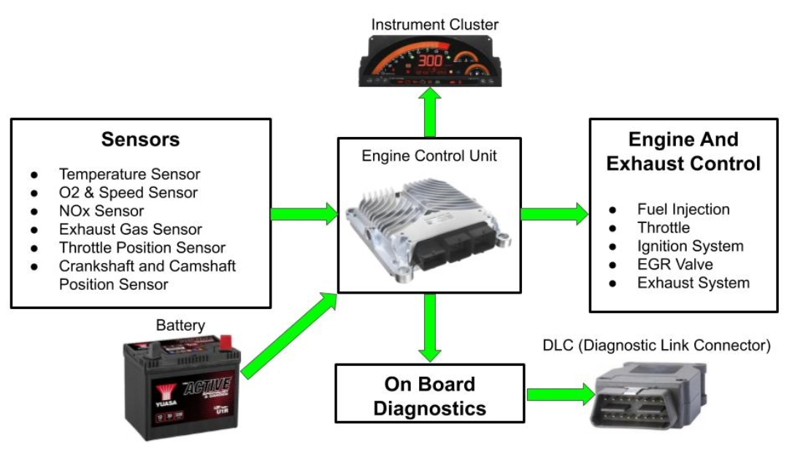
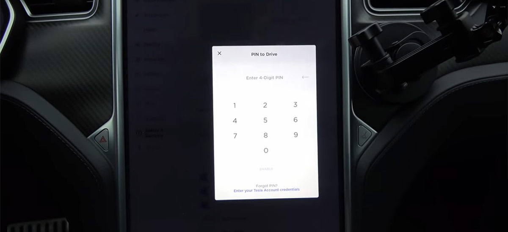
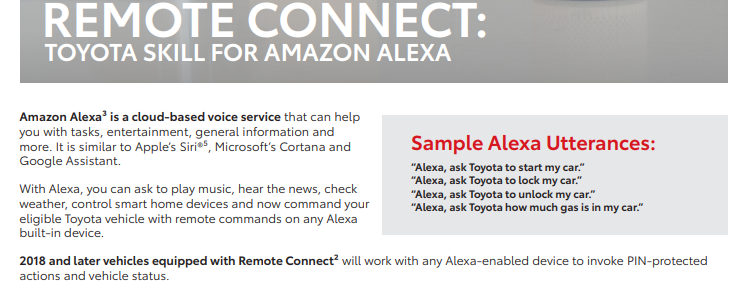

La relación entre los automóviles y las computadoras tiene una trayectoria larga. Desde comienzos de 1980 se implementa una herramienta llamada On-Board Diagnostics(OBD), el propósito de la misma era extender la vida útil de los vehículos dándole capacidades de autodiagnóstico para diversos problemas, e indicarle sobre estos al conductor mediante luces de advertencia.

Estas capacidades se expandirían con la introducción del OBD-II, ya que no solo se trataba de luces en el tablero del conductor, si no que al conectar un lector se podrían obtener códigos como por ejemplo un "P0304" que indicaría problemas de encendido del cuarto cilindro del motor.

Para generar estos códigos es necesario que se reciba información de varios sensores a la unidad de control de motor(ECU), y esta a su vez envía la información que seria interpretada por el OBD-II. En la imagen de abajo se puede apreciar este flujo de información. 

Los componentes computacionales no son solamente para diagnósticos, se usan para casi todo desde el sistema de entretenimiento, hasta el control de temperatura en los asientos. Se estima que, se utilizan como promedio 1,000 chips computacionales o más en los carros de combustion, y hasta el doble para sus contrapartes eléctricas.

La integración de estos componentes con los automóviles del presente es tal, que la industria de manufactura vehicular se vio impactada negativamente con perdidas de hasta $210 billones de dólares en el 2021, debido a problemas de suministros de chips computacionales específicos para la producción de vehículos.

La conveniencia y comodidad de características como sensores de proximidad para abrir puertas, y encendido del carro utilizando un botón representa un valor agregado para los propietarios de los vehículos. Pero para algunos, estas conveniencias representan puertas de oportunidad.
No alt text provided for this image

Un replay attack, o ataque de repetición es cuando un actor malicioso captura una señal, y repite la misma con el objetivo de lograr un resultado dado. Pueden existir multiples finalidades en la ejecución de un ataque como este, por ejemplo: al estar cerca de un edificio que utiliza una puerta de accesso automática se puede interceptar la señal, repetirla, y abrir la puerta sin ser un usuario autorizado.

En el caso de los automóviles este método es de particular interés para criminales que emplean tecnologías para hurtar automobiles vulnerables a este tipo de ataque. Estos criminales no necesariamente comprenden los aspectos técnicos de un replay attack, pero están más que dispuestos a invertir significativamente en equipos que les permitan realizar el ataque.

En mayo, junio y julio del 2021, un grupo criminal logro hurtar alrededor de 30 automóviles Mitsubishi Outlander en West Yorkshire, Inglaterra. Para realizar estos hurtos utilizaron un dispositivo con forma de gameboy, valorado en $21,500 dólares que les permitiría "diagnosticar la señal de un carro, y emular la llave de accesso nativo en 10 a 120 segundos para abrir, cerrar, encender y manejar carros Mitsubishi, Hyundai y Kia" 

Se hace mención de una larga lista de automóviles cuyas señales podrían ser emuladas por este dispositivo, sin embargo necesitarían utilizar el vin del vehículo (que podría ser obtenible atreves del OBD-II) para generar un pin que permitiría emular llaves de ciertos modelos de autos.

Es notable que para los Mitsubishi Outlander 2009-2020 el proceso es automático, por lo cual se podría deducir que los criminales escogieron este modelo en particular por el bajo nivel de dificultad de ejecución del ataque.

En otros casos se podría apreciar a los criminales accionando las maniguetas de los vehículos, mientras utilizan una especie de panel (similares a la imagen de arriba) para buscar la señal de las llaves de los vehículos. Esto se debe a que el transmisor repite la señal que emite el vehículo y busca la respuesta de la llave para enviársela a un segundo dispositivo que se haría pasar por la llave.

En el video de abajo podemos ver varios ejemplos de esta modalidad, también se puede apreciar que para extender el rango máximo de 10-25 metros que suelen tener estos dispositivos, los criminales pueden utilizar antenas yagi que extienden este rango significativamente.

<iframe width="560" height="315" src="https://www.youtube.com/embed/m5pu6XHh0F4" title="YouTube video player" frameborder="0" allow="accelerometer; autoplay; clipboard-write; encrypted-media; gyroscope; picture-in-picture; web-share" allowfullscreen></iframe>

 Es importante notar, que no hace falta dispositivos de alto valor para explotar estas vulnerabilidades. Por ejemplo: la vulnerabilidad CVE-2022-27254 en autos Honda Civic 2016-2020 es explotable como demostrado en una prueba de concepto(PoC), con una computadora, y un dispositivo RF-ONE cuyo costo no excede los $500.00 dólares.

Sin embargo, la aparente preferencia de los criminales por estos dispositivos de alto valor podría ser más bien un indicador del bajo nivel de comprensión de ejecución de los ataques, por lo cual pueda que exista una tendencia a comprar estos productos "listos para usar". 

<h2> Reprogramación de Fob </h2>

 Empezando el minuto 2:55, se puede apreciar que existen otras formas de vulnerar los automóviles. En este caso los criminales utilizaban el software DealerConnect de la concesionaria de autos Jeep y Dodge, con el cual tendrían la capacidad de programar una llave genérica con los códigos originales. Con este método hurtaron más de 100 vehículos que manejaban hasta Mexico para luego venderlos.

Similarmente en Canada, el crimen organizado logro hurtar alrededor de 497 vehículos utilizando el método de reprogramación de fobs, montaban los vehículos hurtados en contenedores que enviarían a Africa y al Medio Oriente para venderlos al doble de su valor de mercado, entre sus objetivos principales estaban vehículos Toyota y Lexus. 

<h2> Es más seguro un vehículo eléctrico? </h2>

Es importante resaltar que tanto los automóviles de combustion como los eléctricos son vulnerables a estos ataques, los Tesla por ejemplo también han sido objetivo de los criminales, en el minuto 2:26 el vehículo que hurtan es un Tesla.

Estos vehículos tienen características de seguridad que les ayudarían a protegerse de estos ataques, como el "Pin to Drive" que requiere un código de 4 dígitos antes de iniciar el carro, sin embargo viene desactivado por default. De igual manera existe la posibilidad que atacantes de mayor sofisticación pudiesen evadir esta medida de seguridad. 

Se podría decir que estos carros tendrían un mayor potencial para ser inseguros, debido a las diversas características, y las interacciones de estas con software de terceros. En el caso de Tesla, una combinación de contraseñas default, malas configuraciones y acceso anónimo le permitiría al investigador de seguridad David Colombo encender varios vehículos de manera remota y sin autorización.

Sin embargo, estas características no son exclusivas de vehículos eléctricos, ya que las compañías de vehículos de combustion buscaran integrar cada vez más características avanzadas en sus productos para mantenerse competitivos.

Toyota por ejemplo, pretende introducir un servicio de suscripción para encender el auto de manera remota, e inclusive utilizar integraciones con Google Assistant y Amazon Alexa para encender el vehículo con un simple "Alexa, ask Toyota to start my car". Un sueño hecho realidad para un actor malicioso avanzado, ya que contaria con multiples superficies de ataques.

Estas situaciones ya son una realidad, en el 2017 la compañía desarrolladora de Metasploit, Rapid7 informo a Hyundai sobre una vulnerabilidad en su app Blue Link, que permitiría que un atacante encendiera remotamente los vehículos.

Compañías como Toyota, Kia y Hyundai, cuentan con programas para recibir reportes de vulnerabilidades por parte de investigadores, lo cual puede ser muy útil para mitigar vulnerabilidades que podrían ser utilizadas por criminales.

Mientras tanto seria una buena idea, mantener las llaves del carros en una bolsita faraday que bloquee las señales emitidas por la llave, mientras las mismas no se estén utilizando. 

**Referencias:**

-   [**OBD Innovations - On Board Diagnostics background history.**](https://www.obdinnovations.com/on-board-diagnostics-obd-background-history/)
-   [**OBD Codes - P0304.**](https://www.obd-codes.com/p0304)
-   [**Popular Mechanics - How it works computer inside your car,**](https://www.popularmechanics.com/cars/how-to/a7386/how-it-works-the-computer-inside-your-car/)
-   [**Electronics Sourcing - How many chips are in our cars.**](https://electronics-sourcing.com/2022/05/04/how-many-chips-are-in-our-cars/)
-   [**IEEE - Chip shortage.**](https://spectrum.ieee.org/chip-shortage)
-   [**Motor Trend - Semiconductor chip shortage reasons.**](https://www.motortrend.com/news/automotive-car-industry-semiconductor-chip-shortage-reasons-solution/)
-   [**NIST - Replay Attack.**](https://csrc.nist.gov/glossary/term/replay_attack)
-   [**Microsoft - Replay Attack.**](https://docs.microsoft.com/en-us/dotnet/framework/wcf/feature-details/replay-attacks)
-   [**Jalopnik - How easy it can be to steal a keyless car.**](https://jalopnik.com/heres-just-how-easy-it-can-be-to-steal-a-keyless-car-1837372230)
-   [**Leeds UK - Gang used nintendo gameboy.**](https://www.leeds-live.co.uk/news/leeds-news/gang-used-nintendo-game-boy-21760001)
-   [**Keyless Repeater - Codegrabber p31 gameboy keyless entry emulator.**](https://keyless-repeater.com/product/codegrabber-p31-gameboy-keyless-entry-system-emulator/#)
-   [**StackOverflow - Unable to get vin response from OBD2.**](https://stackoverflow.com/questions/19158165/unable-to-get-vin-number-response-from-obd-2-device)
-   [**MITRE - CVE-2022-27254.**](https://cve.mitre.org/cgi-bin/cvename.cgi?name=CVE-2022-27254)
-   **Nonamecoder Github - PoC CVE-2022-27254.**
-   [**Jalopnik - Hackers used Fiat Chryslers dealership software.**](https://jalopnik.com/hackers-used-fiat-chryslers-dealership-software-to-stea-1785910125)
-   [**Houston Police Department - Investigation shuts down auto theft suspects**](https://www.houstontx.gov/police/nr/2016/aug/nr160804-1.htm)
-   [**CBC - Police Charge 20 on high end vehicle theft.**](https://www.cbc.ca/news/canada/ottawa/police-charge-20-high-end-vehicle-thefts-1.5396538)
-   [**CBC - Toyota Lexus relay attack.**](https://www.cbc.ca/news/canada/ottawa/toyota-lexus-relay-attack-1.5380947)
-   [**Tesla - Owners Manual Model 3.**](https://www.tesla.com/ownersmanual/model3/en_gb/GUID-94B0E05E-F642-4C8E-8FED-E5EB45FA27DA.html)
-   [**Tesla Motors Club - Pin to drive bypass.**](https://teslamotorsclub.com/tmc/threads/just-found-a-pin-to-drive-bypass.136766/)
-   [**TheDrive - New Tesla hack allows thieves to unlock steal car in 10 seconds.**](https://www.thedrive.com/news/new-tesla-hack-allows-thieves-to-unlock-steal-car-in-10-seconds)
-   [**TheDrive - Watch a pair of thieves steal a Tesla model S by exploiting its keyless entry**](https://www.thedrive.com/news/24355/watch-a-pair-of-thieves-steal-a-tesla-model-s-by-exploiting-its-keyless-entry)**.**
-   [**David Colombo - How I got access to 25 Teslas around the world by accident and curiosity.**](https://medium.com/@david_colombo/how-i-got-access-to-25-teslas-around-the-world-by-accident-and-curiosity-8b9ef040a028)
-   [**Toyota - Remote Connect.**](https://web.archive.org/web/20211214045312/https://www.toyota.com/content/connectedservices/marketing/PDF/Remote_Connect_CFA.pdf)
-   [**Dark Reading - Hyundai BlueLink vulnerability allows remote start of cars.**](https://www.darkreading.com/attacks-breaches/hyundai-blue-link-vulnerability-allows-remote-start-of-cars)
-   [**HackerOne - Toyota Vulnerability Disclosure.**](https://hackerone.com/toyota?view_policy=true)
-   [**Kia - Vulnerability Disclosure.**](https://www.kia.com/eu/vulnerability-disclosure/)
-   [**Hyundai - Vulnerability Disclosure.**](https://www.hyundai.com/eu/vulnerability-disclosure.html)